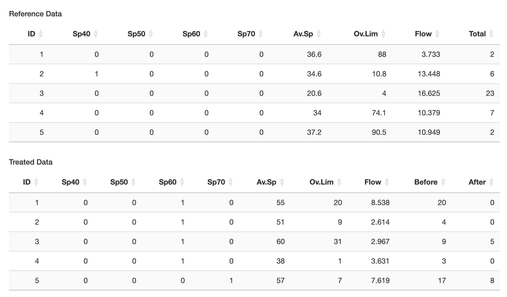
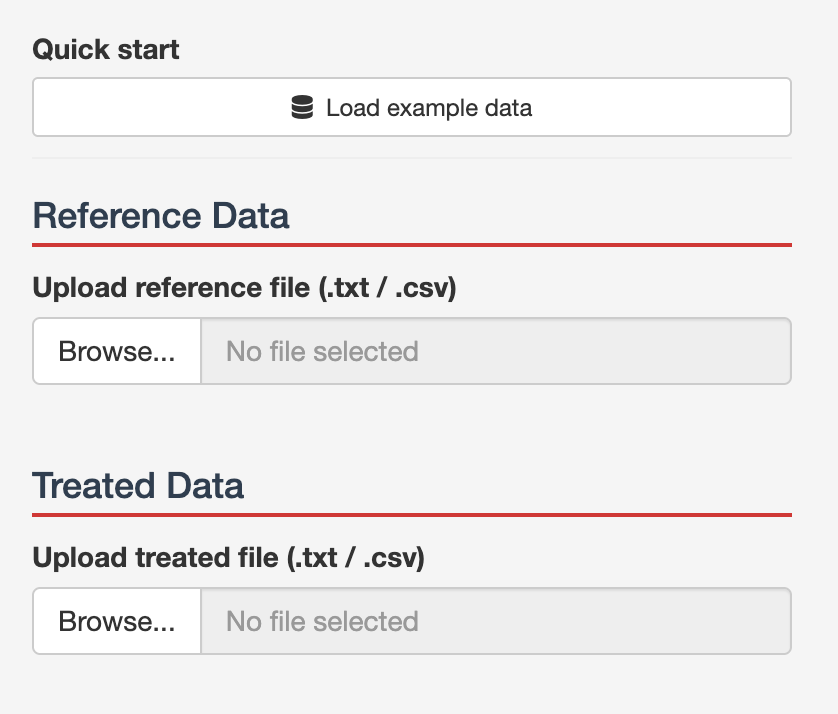
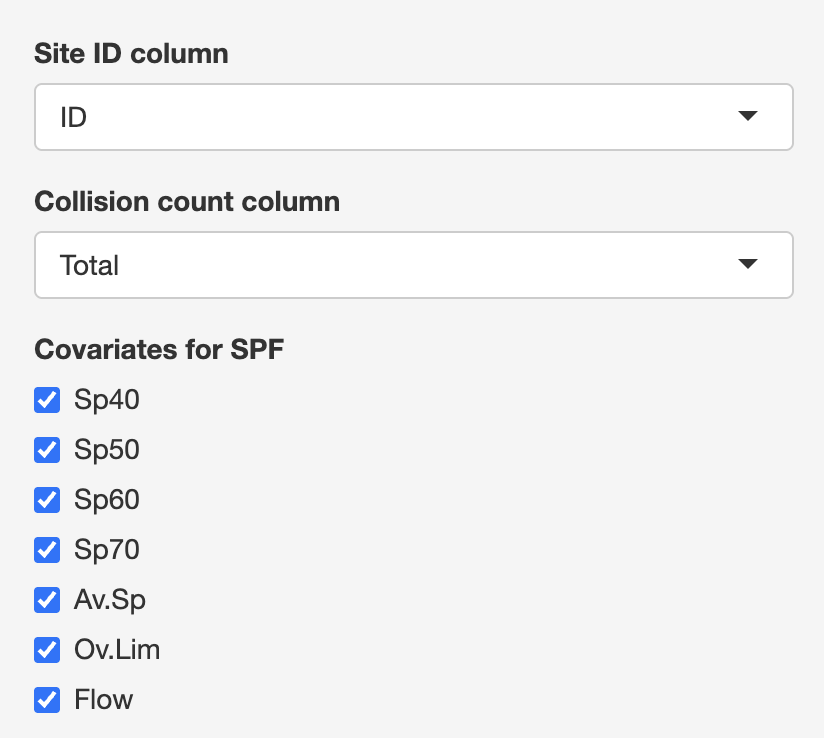
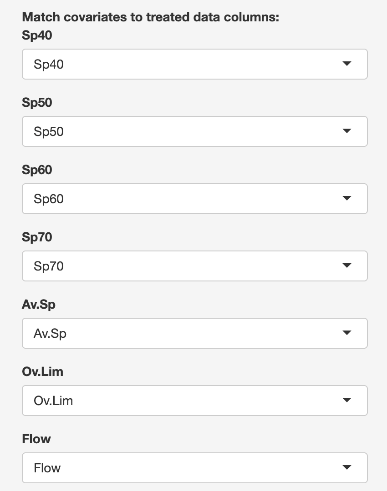
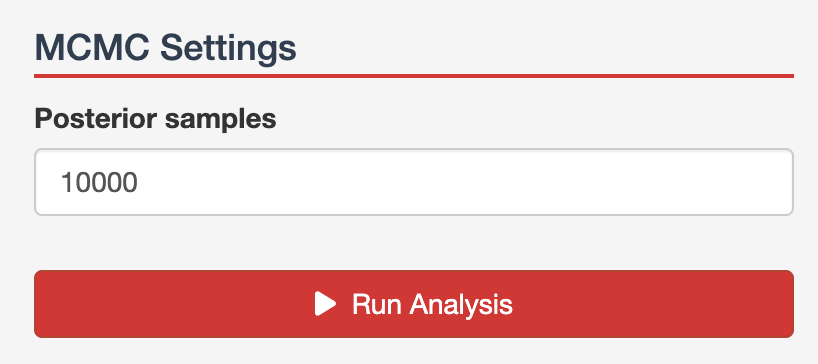
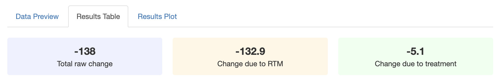
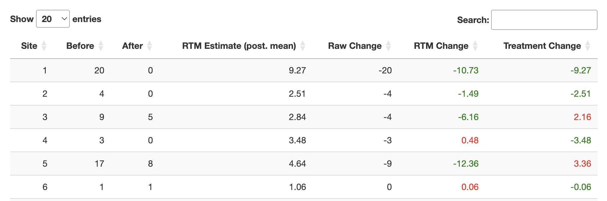
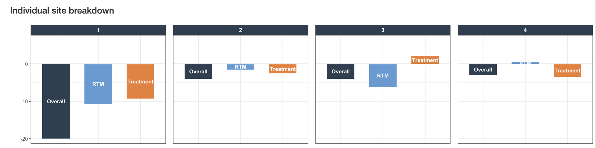

## Introduction

This guide describes how to use the RAPTOR Scheme Evaluation app, which is available [here](https://joematthews-raptorschemeeval.share.connect.posit.cloud). It is developed and maintained by [Joe Matthews](mailto:joe.matthews@ncl.ac.uk) and [Lee Fawcett](mailto:lee.fawcett@ncl.ac.uk) from Newcastle University. The underpinning research methodology is described in [these](https://www.mas.ncl.ac.uk/~nlf8/publications/e001304.full.pdf) [papers](https://www.mas.ncl.ac.uk/~nlf8/publications/ApplStats.pdf).

### Who Can Use the RAPTOR Apps?

The RAPTOR apps are free for use by anyone, and are designed to allow road safety practitioners to implement statistical methods developed by the team at Newcastle University to support their decision making. As an academic institution, we are required to pursue research impact (i.e. the application of research methods which makes a notable difference to society and business), and as such we would greatly appreciate it if you would keep us informed of any cases where the RAPTOR apps have been used (in any way) as part of any decision making process.

### What is the Scheme Evaluation App?

The Scheme Evaluation app provides a statistical estimate of the number of casualties/collisions prevented by the deployment of a road safety countermeasure (e.g. speed cameras, traffic lights). Statistical methods are necessary in scheme evaluation to remove the confounding effects of phenomena such as Regression To the Mean (RTM), which can otherwise artificially inflate estimates of treatment effectiveness. The RTM effect is interpreted as the change in casualties/collisions that would have occurred anyway at the treated location, even if no countermeasure had been deployed.

## Data Upload

### Data Requirements

The Scheme Evaluation app requires two datasets: a **reference dataset** and a **treated dataset**. When using the app for the first time, it is recommended to click **Load Example Data** to see what typical datasets look like.

The **treated dataset** contains road safety data for the locations which have received the treatment being evaluated (e.g. sites where speed cameras have been deployed). Each row corresponds to a different treated location and should contain:

- A site ID value identifying each location
- A collision/casualty count for the period *before* treatment was deployed (the user may choose what counts to use, e.g. collisions, casualties, KSIs)
- A collision/casualty count for the period *after* treatment was deployed
- Descriptor information about the site (e.g. speed limit, average speed, traffic flow, road class)

The **reference dataset** follows the same format as the treated dataset, except it contains data from sites that have *not* received the treatment. It is not necessary for the reference data to include post-treatment counts; only the before-period counts are required.

::: callout-warning
A current implicit assumption of the app is that the before and after periods are of approximately the same length.
:::

### Uploading Data

To upload data, click the **Browse** button under the **Reference Data** and **Treated Data** headings to upload each dataset. The app supports `.csv` and `.txt` files. Alternatively, click **Load Example Data** to proceed with a built-in example (recommended for new users).

{height="200"}

Once files are uploaded, the data will be displayed in tabular form on the right-hand side.

### Column Identification

In the left-hand panel, select the columns corresponding to the site ID variable and the collision/casualty count (before period) for the reference data. Below this are tickboxes under **Covariates for SPF**, one for each additional column in the reference data. Leaving a box ticked means that column will be used as a predictor in the model. Untick a box if a column has a unique value per site (e.g. road name) or if data is not available for all reference and treated sites.

{height="200"}

Scrolling down, select the ID column and the before and after count columns for the treated data.

Finally, a series of dropdown menus — one for each reference data variable — allow you to match each reference column to its corresponding column in the treated dataset.

{height="200"}

Once this is complete, the data upload step is finished.

## Running the Model

At the bottom of the left-hand panel is the **MCMC Settings** section, containing a single input: **Posterior Samples**. In almost all cases this can be left at the default value of 10,000.

{height="100"}

Click **Run Analysis** to run the scheme evaluation model. Once complete, scroll back to the top of the page and click **Results Table** on the right-hand side to view the numerical results.

## Understanding Results

### Results Table

The **Results Table** tab gives a numerical summary of the analysis. The top row shows aggregated results across all treated sites:

- **Total Raw Change** — the change in total counts between the before and after periods (negative values indicate a reduction, so a more negative number is a better outcome)
- **Change due to RTM** — the estimated portion of the change attributable to Regression To the Mean (i.e. what would have changed anyway without the treatment)
- **Change due to Treatment** — the estimated portion of the change attributable to the countermeasure itself

These two figures should sum to the Total Raw Change (subject to rounding).

The table below provides a site-by-site breakdown of the observed before and after counts, the raw change, and how that change is estimated to split between RTM and treatment effects. The **RTM estimate (posterior mean)** is the model's estimated collision count if no treatment had been applied, from which the RTM and treatment contributions are derived.

### Results Plot

The **Results Plot** tab displays the same information graphically, using bar charts to show the observed change in counts and how it decomposes into RTM and treatment effects for each site.

